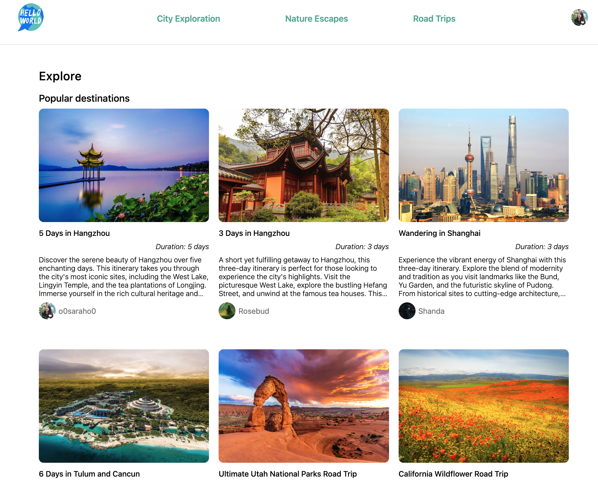
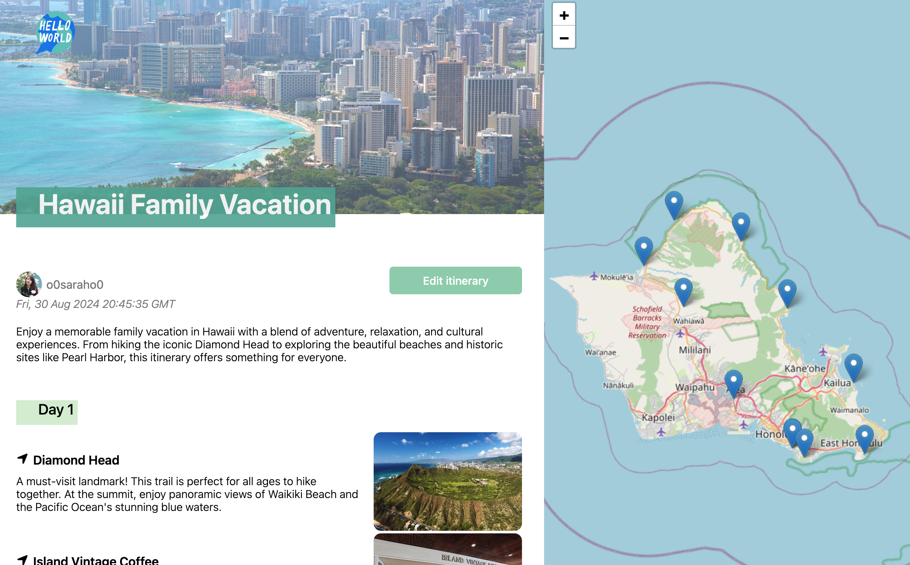

# HelloWorld

**HelloWorld** is an application designed to help users organize their travel experiences, plan daily activities, and share itineraries with other users. My goal is to continuously improve this project, showcasing it as a key piece of my software engineering portfolio.

## Live Link

[Visit HelloWorld](https://travelshare-by-sarah.onrender.com)

### GitHub Repository

[Link to Repository](https://github.com/o0saraho0/TravelShare-AA-Capstone)

## Summary

HelloWorld is built using Flask for the backend and React for the frontend. It offers a range of features to help users organize their travels, from planning itineraries to managing daily activities. The app emphasizes ease of use, allowing users to create, view, and share their travel plans effortlessly.

## Screenshots

- **Itinerary List**
  
- **Itinarary Detail**
  

## Technologies Used

### Frontend:

- 
- 
- 
- 

### Backend:

- 
- 
- 
- 

### Hosting:

- 

## Index

- [Feature List](https://github.com/o0saraho0/TravelShare-AA-Capstone/wiki/Feature-List)
- [Database Schema](https://github.com/o0saraho0/TravelShare-AA-Capstone/wiki/DB-Schema)
- [User Stories](https://github.com/o0saraho0/TravelShare-AA-Capstone/wiki/User-Stories-%E2%80%90-Greenlit)
- [Wireframes](https://github.com/o0saraho0/TravelShare-AA-Capstone/wiki/WireFrame)

## Feature List

### 1. Itineraries

Logged-in users can create, view, edit and delete their travel itineraries

### 2. Activities

Logged-in users can create, view, edit and delete their daily activities

### 3. Comments

Logged-in users can create, view, edit and delete their comments

### 4. Collections

Logged-in users can add itineraries to their collection

## API Documentation & Routes

### Frontend Routes

- Sign Up: /signup
- Log in: /login

### 1. Itineraries

- Travel itineraries list: /itineraries
- Travel itineraries detail: /itineraries/:itinerariesId

### 2. Itineraries Manage

- View my own itineraries: /itineraries/current
- Create new itinerary: /itineraries/new "POST"
- Edit itinerary: /itineraries/:itinerariesId/edit "PUT"

### 3.Collections Manage

- View my own collections: /collections/current

### Backend Routes

**_ All routes will be prefixed with /api _**

### 1. User

- Get current User: /session "GET"
- Login: /session "POST"
- Sign up: /user "POST"

### 2. Itinerary

- Get all itineraries: /itineraries "GET"
- Get all itineraries of current user: /itineraries/current "GET"
- Get itinerary by itinerary Id: /itineraries/:itinerariesId "GET"
- Add itinerary: /itineraries/new "POST"
- Edit itinerary: /itineraries/:itinerariesId/edit "PUT"
- Delete itinerary: /itineraries/:itineraryId "DELETE"

### 3. Comments

- Get all comments by itinerary Id: /comments/itineraries/:itinerariesId "GET"
- Create a review: /comments/itineraries/:itinerariesId/new "POST"
- Edit a review: /comments/:commentId/edit "PUT"
- Delete a review: /comments/:commentId "DELETE"

### 4. Collections

- Get favs of current user: /collections/current "GET"
- Add fav: /collections/:itineraryId "POST"
- Delete fav: /collections/:itineraryId "DELETE"

### 5. Images

- Add itinerary image: /images/itineraries/new "PUT"
- Update itinerary image: /images/itineraries/:itineraryId "PUT"
- Add activity image: /images/activities/new "PUT"
- Update ACTIVITY image: /images/activities/:activityId "PUT"
