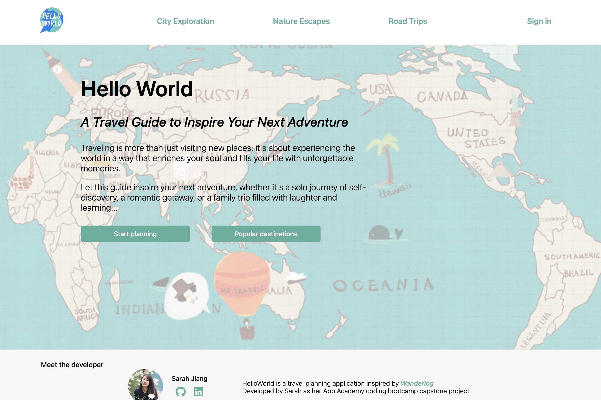
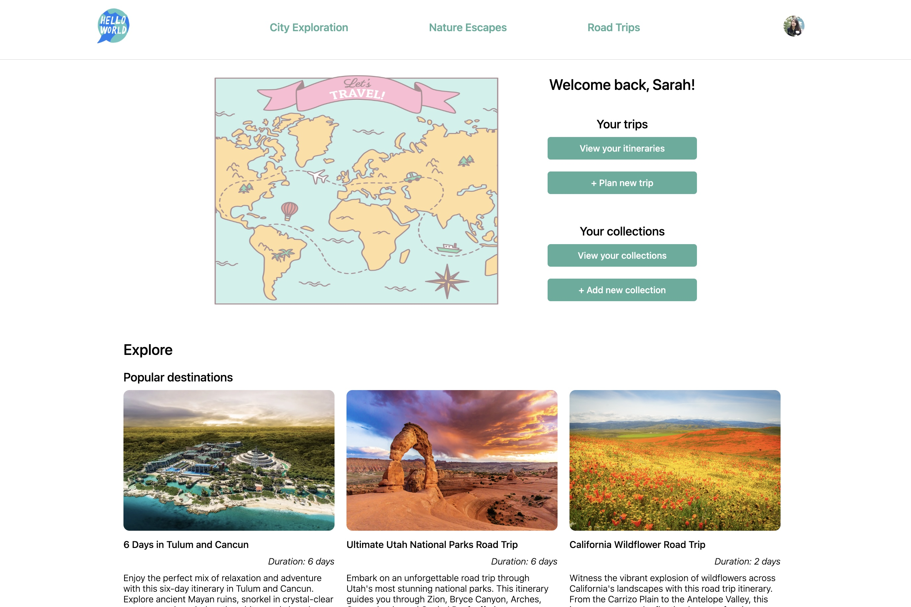
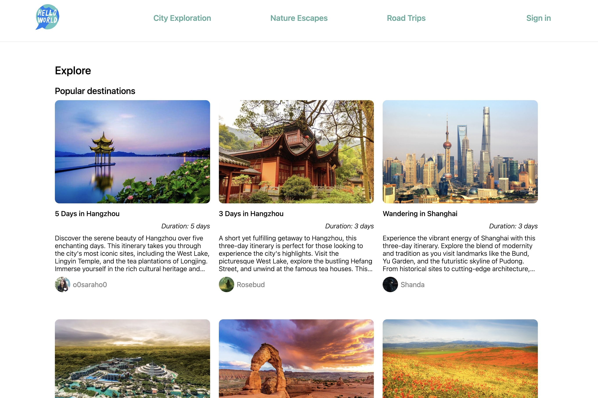
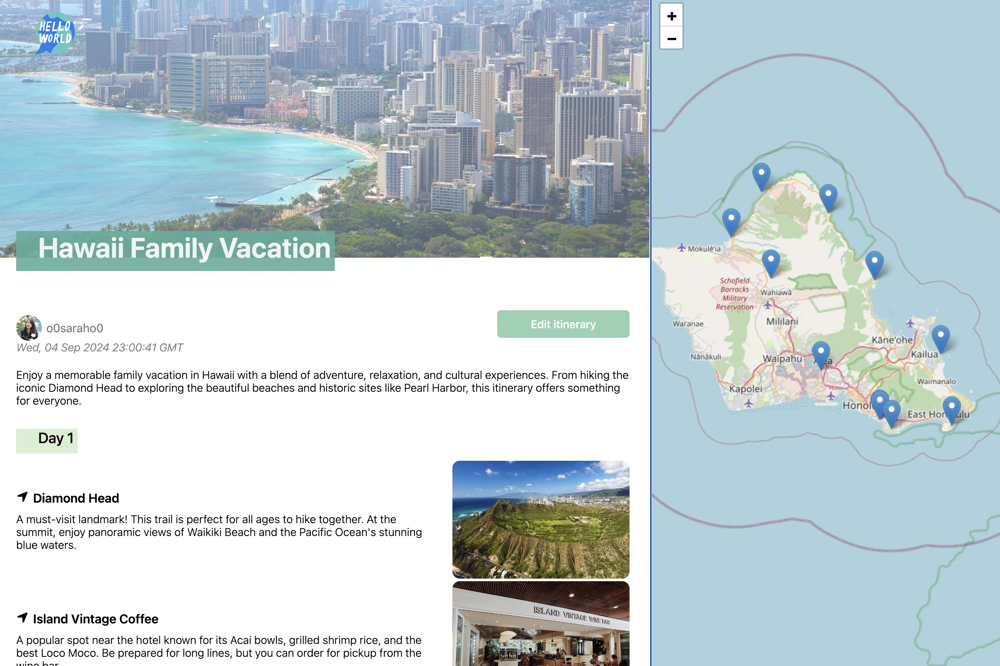
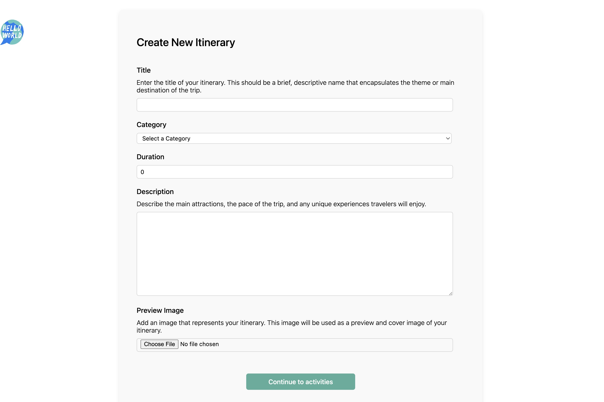
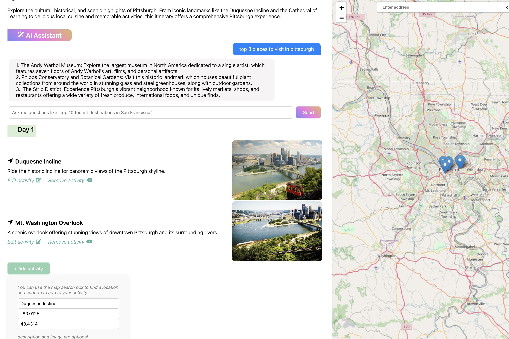

# HelloWorld

**HelloWorld** is an application designed to help users organize their travel experiences, plan daily activities, and share itineraries with other users. My goal is to continuously improve this project, showcasing it as a key piece of my software engineering portfolio.

## Live Link

[Visit HelloWorld](https://travelshare-by-sarah.onrender.com)

## GitHub Repository

[Link to Repository](https://github.com/o0saraho0/TravelShare-AA-Capstone)

## Summary

HelloWorld is built using Flask for the backend and React for the frontend. It offers a range of features to help users organize their travels, from planning itineraries to managing daily activities. The app emphasizes ease of use, allowing users to create, view, and share their travel plans effortlessly.

## Screenshots

- **Landing Page Signed Out**
  
- **Landing Page Signed In**
  
- **Itinerary List**
  
- **Itinarary Detail**
  
- **Itinarary Create**
  
- **Activity Create**
  

## Technologies Used

### 1. Frontend:

- 
- 
- 
- 

### 2. Backend:

- 
- 
- 
- 

### 3. Others:

- 
- 
- 

## Index

- [Feature List](https://github.com/o0saraho0/TravelShare-AA-Capstone/wiki/Feature-List)
- [Database Schema](https://github.com/o0saraho0/TravelShare-AA-Capstone/wiki/DB-Schema)
- [User Stories](https://github.com/o0saraho0/TravelShare-AA-Capstone/wiki/User-Stories-%E2%80%90-Greenlit)
- [Wireframes](https://github.com/o0saraho0/TravelShare-AA-Capstone/wiki/WireFrame)

## Feature List

### 1. Itineraries

Logged-in users can create, view, edit and delete their travel itineraries

### 2. Activities

Logged-in users can create, view, edit and delete their daily activities

### 3. Comments

Logged-in users can create, view, edit and delete their comments

### 4. Collections

Logged-in users can add itineraries to their collection

## API Documentation & Routes

### 1. Current User

- **Purpose:** Authenticates the current user and returns their information if they are logged in.
- **Method:** GET
- **URL:** /api/auth/
- **Successful Response:** HTTP Status Code 200

```json
{
  "email": "sarah.jiang@example.com",
  "first_name": "Sarah",
  "id": 1,
  "last_name": "Jiang",
  "profile_url": "/images/profile_Sarah.JPG",
  "username": "o0saraho0"
}
```

- **Error Response:** HTTP Status Code 401

```json
{
  "errors": {
    "message": "Unauthorized"
  }
}
```

### 2. Login

- **Purpose:** Logs in a user with the provided credentials.
- **Method:** POST
- **URL:** /api/auth/login
- **Body:**

```json
{
  "email": "sarah.jiang@example.com",
  "password": "string"
}
```

- **Successful Response:** HTTP Status Code 200

```json
{
  "email": "sarah.jiang@example.com",
  "first_name": "Sarah",
  "id": 1,
  "last_name": "Jiang",
  "profile_url": "/images/profile_Sarah.JPG",
  "username": "o0saraho0"
}
```

- **Error Response:** HTTP Status Code 401

```json
{
  "email": ["This field is required."],
  "password": ["This field is required."]
}
```

### 3. Logout

- **Purpose:** Logs out the current user.
- **Method:** POST
- **URL:** /api/auth/logout
- **Successful Response:** HTTP Status Code 200

```json
{
  "message": "User logged out"
}
```

### 4. Sign Up

- **Purpose:** Creates a new user and logs them in.
- **Method:** POST
- **URL:** /api/auth/signup
- **Body:**

```json
{
  "email": "sarah.jiang@example.com",
  "first_name": "Sarah",
  "last_name": "Jiang",
  "password": "string",
  "username": "o0saraho0"
}
```

- **Successful Response:** HTTP Status Code 201

```json
{
  "email": "sarah.hello@example.com",
  "first_name": "Sarah",
  "id": 9,
  "last_name": "Jiang",
  "profile_url": "https://cdn.pixabay.com/photo/2015/10/05/22/37/blank-profile-picture-973460_1280.png",
  "username": "hello"
}
```

- **Error Response:** HTTP Status Code 401

```json
{
  "email": ["This field is required."],
  "first_name": ["This field is required."],
  "last_name": ["This field is required."],
  "password": ["This field is required."],
  "username": ["This field is required."]
}
{
    "email": ["Email address is already in use."],
    "username": ["Username is already in use."]
}
```

### 5. Unauthorized

- **Purpose:** Returns an unauthorized error when authentication fails.
- **Method:** GET
- **URL:** /api/auth/unauthorized
- **Error Response:** HTTP Status Code 401

```json
{
  "errors": {
    "message": "Unauthorized"
  }
}
```

## Itineraries

### 1. Get All Itineraries

- **Purpose:** Get all itineraries
- **Method:** GET
- **URL:** /api/itineraries/
- **Successful Response:** HTTP Status Code 200

```json
{
  "category_id": 1,
  "description": "Discover the serene beauty of Hangzhou over five enchanting days. This itinerary takes you through the city's most iconic sites, including the West Lake, Lingyin Temple, and the tea plantations of Longjing. Immerse yourself in the rich cultural heritage and tranquil landscapes that have inspired poets and artists for centuries.",
  "duration": 5,
  "id": 1,
  "preview_image_url": "/images/Hangzhou1_01.jpg",
  "schedules": [
    {
      "activities": [
        {
          "description": "Start your exploration at West Lake, the most famous attraction in Hangzhou. Take a leisurely walk or rent a bike to explore the scenic area. Enjoy a boat ride on West Lake to see iconic spots like Three Pools Mirroring the Moon and Broken Bridge.",
          "id": 1,
          "latitude": 30.243945,
          "longitude": 120.144128,
          "place": "West Lake",
          "place_image_url": "/images/Hangzhou1_01.jpg",
          "schedule_id": 1
        }
      ],
      "day": "Day 1",
      "id": 1,
      "itinerary_id": 1
    }
  ],
  "title": "5 Days in Hangzhou",
  "traveler": {
    "email": "sarah.jiang@example.com",
    "first_name": "Sarah",
    "id": 1,
    "last_name": "Jiang",
    "profile_url": "/images/profile_Sarah.JPG",
    "username": "o0saraho0"
  },
  "updated_at": "Fri, 30 Aug 2024 20:41:24 GMT"
}
```

### 2. Get all Itineraries by Current User

- **Purpose:** Get all itineraries owned by current user
- **Method:** GET
- **URL:** /api/itineraries/current
- **Successful Response:** HTTP Status Code 200

```json
[
  {
    "category_id": 1,
    "description": "Discover the serene beauty of Hangzhou over five enchanting days. This itinerary takes you through the city's most iconic sites, including the West Lake, Lingyin Temple, and the tea plantations of Longjing. Immerse yourself in the rich cultural heritage and tranquil landscapes that have inspired poets and artists for centuries.",
    "duration": 5,
    "id": 1,
    "preview_image_url": "/images/Hangzhou1_01.jpg",
    "schedules": [
      {
        "activities": [
          {
            "description": "Start your exploration at West Lake, the most famous attraction in Hangzhou. Take a leisurely walk or rent a bike to explore the scenic area. Enjoy a boat ride on West Lake to see iconic spots like Three Pools Mirroring the Moon and Broken Bridge.",
            "id": 1,
            "latitude": 30.243945,
            "longitude": 120.144128,
            "place": "West Lake",
            "place_image_url": "/images/Hangzhou1_01.jpg",
            "schedule_id": 1
          }
        ],
        "day": "Day 1",
        "id": 1,
        "itinerary_id": 1
      }
    ],
    "title": "5 Days in Hangzhou",
    "traveler": {
      "email": "sarah.jiang@example.com",
      "first_name": "Sarah",
      "id": 1,
      "last_name": "Jiang",
      "profile_url": "/images/profile_Sarah.JPG",
      "username": "o0saraho0"
    },
    "updated_at": "Fri, 30 Aug 2024 20:41:24 GMT"
  }
]
```

- **Error Response:** HTTP Status Code 401

```json
{
  "errors": {
    "message": "Unauthorized"
  }
}
```

### 3. Get itinerary by Itinerary ID

- **Purpose:** Get detailed itinerary information by itinerary ID
- **Method:** GET
- **URL:** /api/itineraries/:itineraryId
- **Successful Response:** HTTP Status Code 200

```json
{
  "category_id": 1,
  "description": "Discover the serene beauty of Hangzhou over five enchanting days. This itinerary takes you through the city's most iconic sites, including the West Lake, Lingyin Temple, and the tea plantations of Longjing. Immerse yourself in the rich cultural heritage and tranquil landscapes that have inspired poets and artists for centuries.",
  "duration": 5,
  "id": 1,
  "preview_image_url": "/images/Hangzhou1_01.jpg",
  "schedules": [
    {
      "activities": [
        {
          "description": "Start your exploration at West Lake, the most famous attraction in Hangzhou. Take a leisurely walk or rent a bike to explore the scenic area. Enjoy a boat ride on West Lake to see iconic spots like Three Pools Mirroring the Moon and Broken Bridge.",
          "id": 1,
          "latitude": 30.243945,
          "longitude": 120.144128,
          "place": "West Lake",
          "place_image_url": "/images/Hangzhou1_01.jpg",
          "schedule_id": 1
        }
      ],
      "day": "Day 1",
      "id": 1,
      "itinerary_id": 1
    }
  ],
  "title": "5 Days in Hangzhou",
  "traveler": {
    "email": "sarah.jiang@example.com",
    "first_name": "Sarah",
    "id": 1,
    "last_name": "Jiang",
    "profile_url": "/images/profile_Sarah.JPG",
    "username": "o0saraho0"
  },
  "updated_at": "Fri, 30 Aug 2024 20:41:24 GMT"
}
```

- **Error Response:** HTTP Status Code 401

```json
{
  "errors": {
    "message": "Unauthorized"
  }
}
```

### 4. Create a New Itinerary

- **Purpose:** Create a new itinerary
- **Method:** POST
- **URL:** /api/itineraries/new
- **Headers:** Content-Type: application/json
- **Body:**

```json
{
  "title": "2 Days in Hangzhou",
  "category_id": 1,
  "description": "Discover the serene beauty of Hangzhou over five enchanting days. This itinerary takes you through the city's most iconic sites, including the West Lake, Lingyin Temple, and the tea plantations of Longjing. Immerse yourself in the rich cultural heritage and tranquil landscapes that have inspired poets and artists for centuries.",
  "duration": 2,
  "preview_image_url": "/images/Hangzhou1_01.jpg"
}
```

- **Successful Response:** HTTP Status Code 201

```json
{
  "category_id": 1,
  "description": "Discover the serene beauty of Hangzhou over five enchanting days. This itinerary takes you through the city's most iconic sites, including the West Lake, Lingyin Temple, and the tea plantations of Longjing. Immerse yourself in the rich cultural heritage and tranquil landscapes that have inspired poets and artists for centuries.",
  "duration": 2,
  "id": 21,
  "preview_image_url": "/images/Hangzhou1_01.jpg",
  "schedules": [
    {
      "activities": [],
      "day": "Day 1",
      "id": 63,
      "itinerary_id": 21
    },
    {
      "activities": [],
      "day": "Day 2",
      "id": 64,
      "itinerary_id": 21
    }
  ],
  "title": "2 Days in Hangzhou",
  "traveler": {
    "email": "sarah.jiang@example.com",
    "first_name": "Sarah",
    "id": 1,
    "last_name": "Jiang",
    "profile_url": "/images/profile_Sarah.JPG",
    "username": "o0saraho0"
  },
  "updated_at": "Tue, 03 Sep 2024 20:22:14 GMT"
}
```

- **Error Response:** Body validation errors 400

```json
{
  "category_id": ["This field is required."],
  "duration": ["This field is required."],
  "preview_image_url": ["This field is required."],
  "title": ["This field is required."]
}
```

### 5. Edit an Itinerary

- **Purpose:** Edit an itinerary
- **Method:** PUT
- **URL:** /api/itineraries/:itineraryId/edit
- **Headers:** Content-Type: application/json
- **Body:**

```json
{
  "title": "5 Days in Hangzhou",
  "category_id": 1,
  "description": "Discover the serene beauty of Hangzhou over five enchanting days. This itinerary takes you through the city's most iconic sites, including the West Lake, Lingyin Temple, and the tea plantations of Longjing. Immerse yourself in the rich cultural heritage and tranquil landscapes that have inspired poets and artists for centuries.",
  "duration": 5,
  "preview_image_url": "/images/Hangzhou1_01.jpg"
}
```

- **Successful Response:** HTTP Status Code 200

```json
{
  "category_id": 1,
  "description": "Discover the serene beauty of Hangzhou over five enchanting days. This itinerary takes you through the city's most iconic sites, including the West Lake, Lingyin Temple, and the tea plantations of Longjing. Immerse yourself in the rich cultural heritage and tranquil landscapes that have inspired poets and artists for centuries.",
  "duration": 2,
  "id": 1,
  "preview_image_url": "/images/Hangzhou1_01.jpg",
  "schedules": [
    {
      "activities": [
        {
          "description": "Start your exploration at West Lake, the most famous attraction in Hangzhou. Take a leisurely walk or rent a bike to explore the scenic area. Enjoy a boat ride on West Lake to see iconic spots like Three Pools Mirroring the Moon and Broken Bridge.",
          "id": 1,
          "latitude": 30.243945,
          "longitude": 120.144128,
          "place": "West Lake",
          "place_image_url": "/images/Hangzhou1_01.jpg",
          "schedule_id": 1
        }
      ],
      "day": "Day 1",
      "id": 1,
      "itinerary_id": 1
    }
  ],
  "title": "5 Days in Hangzhou",
  "traveler": {
    "email": "sarah.jiang@example.com",
    "first_name": "Sarah",
    "id": 1,
    "last_name": "Jiang",
    "profile_url": "/images/profile_Sarah.JPG",
    "username": "o0saraho0"
  },
  "updated_at": "Tue, 03 Sep 2024 20:27:00 GMT"
}
```

- **Error Response:** Body validation errors 400

```json
{
  "category_id": ["This field is required."],
  "duration": ["This field is required."],
  "preview_image_url": ["This field is required."],
  "title": ["This field is required."]
}
```

### 6. Delete an Itinerary

- **Purpose:** Delete itinerary by itinerary id
- **Method:** DELETE
- **URL:** /api/itineraries/:itineraryId
- **Successful Response:** HTTP Status Code 200

```json
{
  "message": "Successfully deleted"
}
```

- **Error Response:** Couldn't find a itinerary with the specified id 404

```json
{ "error": "Itinerary could not be found" }
```

## Activity

### 1. Get All Activities by ScheduleId

- **Purpose:** Get all activities by scheduleId
- **Method:** GET
- **URL:** /api/activities/schedule/:scheduleId
- **Successful Response:** HTTP Status Code 200

```json
[
  {
    "description": "Watch this spectacular evening show on the lake, featuring lights, music, and dance.",
    "id": 2,
    "latitude": 30.256339,
    "longitude": 120.138635,
    "place": "Impression West Lake Show",
    "place_image_url": "/images/Hangzhou1_02.webp",
    "schedule_id": 1
  }
]
```

### 2. Create a New Activity

- **Purpose:** Create a new activity
- **Method:** POST
- **URL:** /api/activities/schedule/:scheduleId/new
- **Headers:** Content-Type: application/json
- **Body:**

```json
{
  "description": "Watch this spectacular evening show on the lake, featuring lights, music, and dance.",
  "id": 2,
  "latitude": 30.256339,
  "longitude": 120.138635,
  "place": "Impression West Lake Show",
  "place_image_url": "/images/Hangzhou1_02.webp"
}
```

- **Successful Response:** HTTP Status Code 201

```json
{
  "description": "Watch this spectacular evening show on the lake, featuring lights, music, and dance.",
  "id": 2,
  "latitude": 30.256339,
  "longitude": 120.138635,
  "place": "Impression West Lake Show",
  "place_image_url": "/images/Hangzhou1_02.webp",
  "schedule_id": 1
}
```

- **Error Response:** Body validation errors 400

```json
{
  "latitude": ["This field is required."],
  "longitude": ["This field is required."],
  "place": ["This field is required."],
  "schedule_id": ["This field is required."]
}
```

### 3. Edit an Activity

- **Purpose:** Edit an activity by activity id
- **Method:** PUT
- **URL:** /api/activities/:activityId/edit
- **Headers:** Content-Type: application/json
- **Body:**

```json
{
  "description": "Watch this spectacular evening show on the lake, featuring lights, music, and dance.",
  "id": 2,
  "latitude": 30.256339,
  "longitude": 120.138635,
  "place": "Impression West Lake Show",
  "place_image_url": "/images/Hangzhou1_02.webp"
}
```

- **Successful Response:** HTTP Status Code 200

```json
{
  "description": "Watch this spectacular evening show on the lake, featuring lights, music, and dance.",
  "id": 2,
  "latitude": 30.256339,
  "longitude": 120.138635,
  "place": "Impression West Lake Show",
  "place_image_url": "/images/Hangzhou1_02.webp",
  "schedule_id": 1
}
```

- **Error Response:** Body validation errors 400

```json
{
  "latitude": ["This field is required."],
  "longitude": ["This field is required."],
  "place": ["This field is required."],
  "schedule_id": ["This field is required."]
}
```

### 4. Delete an Activity

- **Purpose:** Delete an activity by activity id
- **Method:** DELETE
- **URL:** /api/activities/:activityId
- **Successful Response:** HTTP Status Code 200

```json
{
  "message": "Successfully deleted"
}
```

- **Error Response:** Couldn't find an activity with the specified id 404

```json
{ "error": "Activity could not be found" }
```

## Collection

### 1. Get All Collections by Current User

- **Purpose:** Get all collections collected by current user
- **Method:** GET
- **URL:** /api/collections/current
- **Successful Response:** HTTP Status Code 200

```json
[
  {
    "id": 1,
    "itinerary": {
      "category_id": 1,
      "description": "Discover the serene beauty of Hangzhou over five enchanting days. This itinerary takes you through the city's most iconic sites, including the West Lake, Lingyin Temple, and the tea plantations of Longjing. Immerse yourself in the rich cultural heritage and tranquil landscapes that have inspired poets and artists for centuries.",
      "duration": 2,
      "id": 1,
      "preview_image_url": "/images/Hangzhou1_01.jpg",
      "schedules": [
        {
          "activities": [
            {
              "description": "Watch this spectacular evening show on the lake, featuring lights, music, and dance.",
              "id": 2,
              "latitude": 30.256339,
              "longitude": 120.138635,
              "place": "Impression West Lake Show",
              "place_image_url": "/images/Hangzhou1_02.webp",
              "schedule_id": 1
            }
          ],
          "day": "Day 1",
          "id": 1,
          "itinerary_id": 1
        }
      ],
      "title": "5 Days in Hangzhou",
      "updated_at": "Tue, 03 Sep 2024 20:27:00 GMT"
    },
    "itinerary_id": 1
  }
]
```

### 2. Create a New Collection

- **Purpose:** Create a new collection
- **Method:** POST
- **URL:** /api/collections/:itineraryId
- **Headers:** Content-Type: application/json
- **Body:**

```json
{
  "itinerary_id": 6
}
```

- **Successful Response:** HTTP Status Code 200

```json
{ "id": 1, "user_id": 1 }
```

- **Error Response:** Validation errors 500

```json
{ "message": "User already collected this itinerary." }
```

### 3. Delete a Collection

- **Purpose:** Delete a collection
- **Method:** DELETE
- **URL:** /api/collections/:itineraryId
- **Successful Response:** HTTP Status Code 200

```json
{
  "message": "Successfully deleted"
}
```

- **Error Response:** Couldn't find a collection with the specified id 404

```json
{ "message": "Collection could not be found." }
```

## Comment

### 1. Get All Comments by Itinerary ID

- **Purpose:** Get all comments by itineraryId
- **Method:** GET
- **URL:** /api/comments/itineraries/:itineraryId
- **Successful Response:** HTTP Status Code 200

```json
[
  {
    "id": 1,
    "itinerary_id": 1,
    "review": "I wish I had seen this itinerary earlier because it would have allowed me to spend more time at these incredible places. Each location was more beautiful and interesting than I had anticipated, and I feel like I could have made the trip even more enjoyable if I had planned to stay longer at some of the spots.",
    "updated_at": "Fri, 30 Aug 2024 20:41:24 GMT",
    "user": {
      "email": "sarah.jiang@example.com",
      "first_name": "Sarah",
      "id": 1,
      "last_name": "Jiang",
      "profile_url": "/images/profile_Sarah.jpeg",
      "username": "o0saraho0"
    }
  }
]
```

### 2. Create a New Comment

- **Purpose:** Create a new comment
- **Method:** POST
- **URL:** /api/comments/itineraries/itineraryId/new
- **Headers:** Content-Type: application/json
- **Body:**

```json
{ "review": "Great", "itinerary_id": 1 }
```

- **Successful Response:** HTTP Status Code 201

```json
{
  "id": 31,
  "itinerary_id": 1,
  "review": "Great",
  "updated_at": "Tue, 03 Sep 2024 20:59:59 GMT",
  "user": {
    "email": "sarah.hello@example.com",
    "first_name": "Sarah",
    "id": 1,
    "last_name": "Jiang",
    "profile_url": "/images/profile_Sarah.jpeg",
    "username": "hello"
  }
}
```

- **Error Response:** Body validation errors 400

```json
{
  "itinerary_id": ["This field is required."],
  "review": ["This field is required."]
}
```

### 3. Edit an Exsiting Comment

- **Purpose:** Edit a comment by comment id
- **Method:** PUT
- **URL:** /api/comments/:commentId/edit
- **Headers:** Content-Type: application/json
- **Body:**

```json
{ "review": "not so good", "itinerary_id": "1" }
```

- **Successful Response:** HTTP Status Code 200

```json
{
  "id": 31,
  "itinerary_id": 1,
  "review": "not so good",
  "updated_at": "Tue, 03 Sep 2024 21:02:18 GMT",
  "user": {
    "email": "sarah.hello@example.com",
    "first_name": "Sarah",
    "id": 9,
    "last_name": "Jiang",
    "profile_url": "https://cdn.pixabay.com/photo/2015/10/05/22/37/blank-profile-picture-973460_1280.png",
    "username": "hello"
  }
}
```

- **Error Response:** Body validation errors 400

```json
{
  "itinerary_id": ["This field is required."],
  "review": ["This field is required."]
}
```

## Future Implementation Goals

- Notifications
- AI assistance for activity recommendation

## Connect

- [LinkedIn](www.linkedin.com/in/sarah-yue-jiang)
- [GitHub](https://github.com/o0saraho0)
